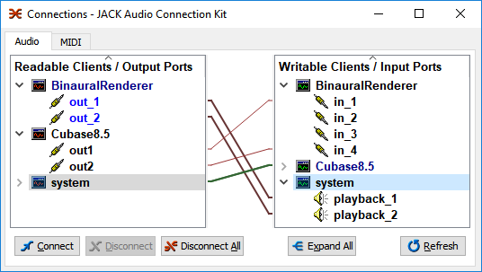
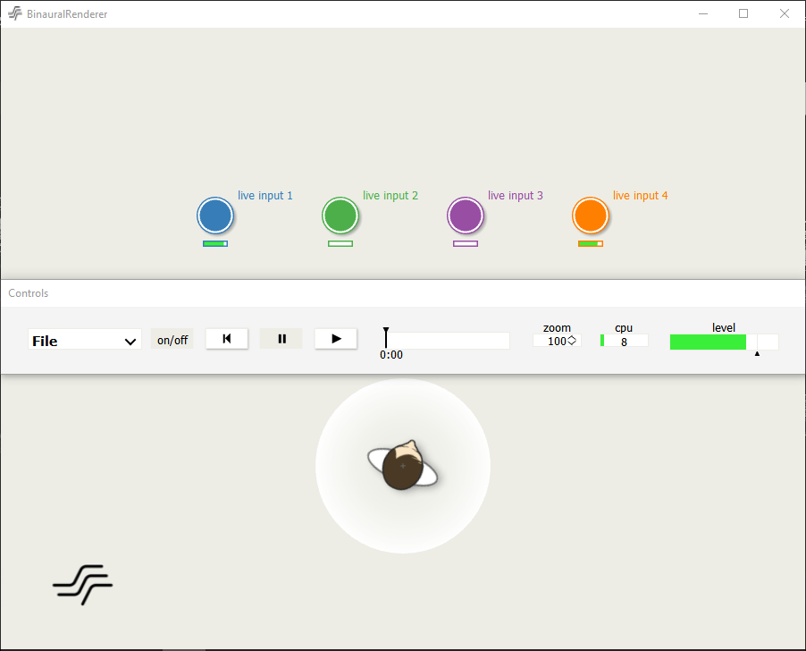

This is a fork of the SoundScape Renderer ([SSR](https://github.com/SoundScapeRenderer/ssr)), which aims at porting the source code to Windows.

The basic idea is to cross-compile on a linux machine an executable (.exe) for Windows.
We use the M cross environment ([MXE](http://mxe.cc/)), which provides cross-compilation scripts for the dependencies and the MinGW64 (GCC) compiler.

Pre-compiled binaries for Windows currently include:   
 `ssr-binaural.exe`, `ssr-brs.exe`, `ssr-vbap.exe`, `ssr-wfs.exe`, `ssr-aap.exe`, `ssr-dca.exe` and `ssr-generic.exe`.

They should run on all x86-64 CPUs. 

Getting started
---------------
* Install Jack Audio for Windows (64bit) from [Jack Audio Downloads](http://www.jackaudio.org/downloads/).
* Get it running by following the [Installation and Configuration](http://jackaudio.org/faq/jack_on_windows.html).
* Download and run the latest installer [Release](https://github.com/chris-hld/ssr/releases).
* Adapt the configuration file e.g. `ssr.conf.windows` to your needs.

Running the SSR on Windows
--------------------------
* Have a look at the [Documentation](http://ssr.readthedocs.io/en/latest/operation.html#running-the-ssr)
* First, start the Jack Audio Server, e.g. with `qjackctl.exe`.
* Start the SSR. Navigate a terminal to your installation folder and start from the terminal.
* Optional: Start your ASIO playback Software.
* Connect everything using Jack Audio Connection.

This could look like this:

---

This is the source distribution of SoundScape Renderer (SSR) licensed under the
GPLv3+. Please consult the file COPYING for more information about this license.

The user manual in the doc/ directory contains relevant informations about the
SSR, including installation instructions. Additional (very detailed)
installation instructions can be found in the file INSTALL.

For questions, bug reports and feature requests:

Contact:       ssr@spatialaudio.net
Website:       http://spatialaudio.net/ssr/
Documentation: https://ssr.readthedocs.io/

Copyright (c) 2016-2018 Division of Applied Acoustics
                        Chalmers University of Technology

Copyright (c) 2012-2021 Institut für Nachrichtentechnik, Universität Rostock

Copyright (c) 2006-2012 Quality & Usability Lab
                        Deutsche Telekom Laboratories, TU Berlin

