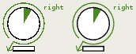
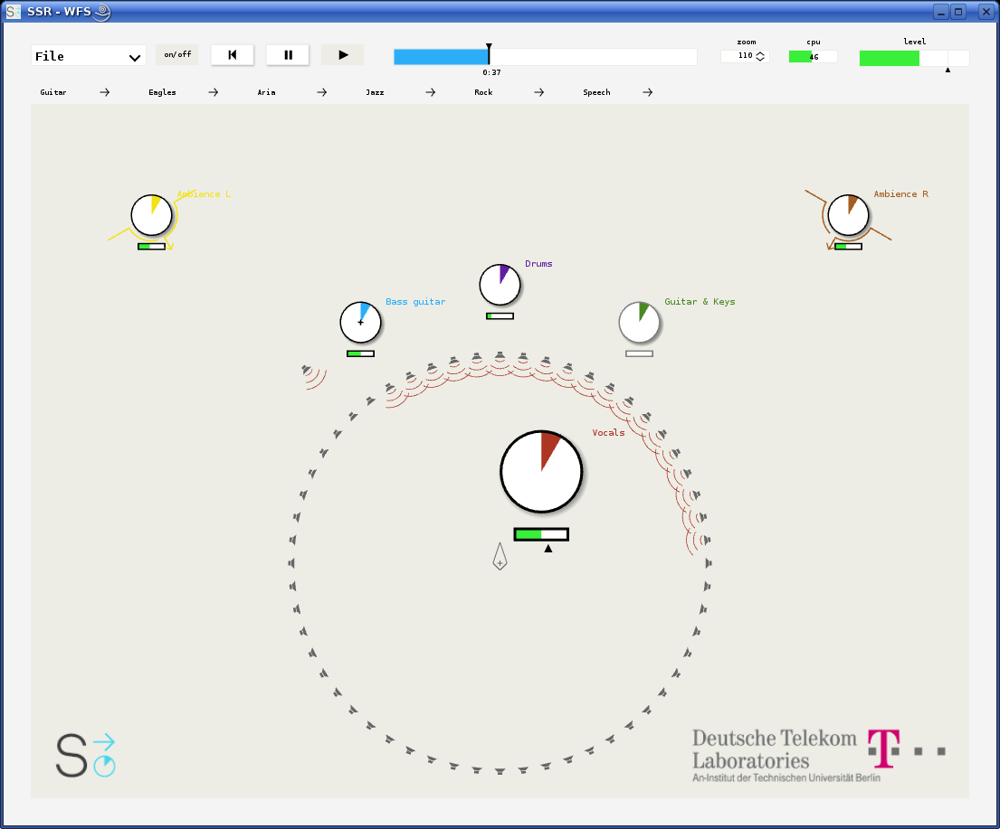
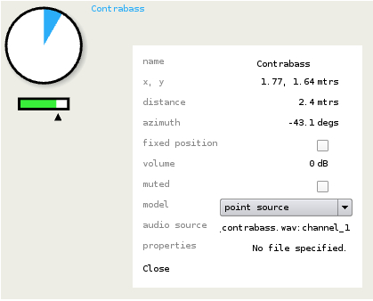

.. ****************************************************************************
 * Copyright © 2012-2014 Institut für Nachrichtentechnik, Universität Rostock *
 * Copyright © 2006-2014 Quality & Usability Lab,                             *
 *                       Telekom Innovation Laboratories, TU Berlin           *
 *                                                                            *
 * This file is part of the SoundScape Renderer (SSR).                        *
 *                                                                            *
 * The SSR is free software:  you can redistribute it and/or modify it  under *
 * the terms of the  GNU  General  Public  License  as published by the  Free *
 * Software Foundation, either version 3 of the License,  or (at your option) *
 * any later version.                                                         *
 *                                                                            *
 * The SSR is distributed in the hope that it will be useful, but WITHOUT ANY *
 * WARRANTY;  without even the implied warranty of MERCHANTABILITY or FITNESS *
 * FOR A PARTICULAR PURPOSE.                                                  *
 * See the GNU General Public License for more details.                       *
 *                                                                            *
 * You should  have received a copy  of the GNU General Public License  along *
 * with this program.  If not, see <http://www.gnu.org/licenses/>.            *
 *                                                                            *
 * The SSR is a tool  for  real-time  spatial audio reproduction  providing a *
 * variety of rendering algorithms.                                           *
 *                                                                            *
 * http://spatialaudio.net/ssr                           ssr@spatialaudio.net *
 ******************************************************************************

.. _gui:

Graphical User Interface
========================

Our graphical user interface (GUI) is quite costly in terms of
computation. So we emphatically recommend that you **properly configure
the hardware acceleration of your graphics card**. If you still have
performance issues make the window as small as possible. The smaller the
window is the less is the processing cost.

The SSR GUI tries to enable samplebuffer support to enable anti-aliasing
of the screen output. It will tell you if it didn't work out. Check
Fig. :ref:`4.1 <antialiasing>` to get an idea of the influence of
anti-aliasing. One day we will also implement a variable frequency for
the screen update so that you can slow it down if CPU load is too high.
Of course it won't look as nice then.

.. _antialiasing:

    No anti-aliasing on the left image.

.. _screenshot:

   Screen shot of the SSR GUI.

General Layout
--------------

The graphical user interface (GUI) consists mainly of an illustration of
the scene that you are hearing and some interaction tools. The renderer
type is indicated in the window title. See a screen shot in
Fig. :ref:`4.2 <screenshot>`.

On the top left you will find the file menu where you can open files,
save scenes, and quit the application. So far only the *save scene as…*
option is available. That means every time to save the current scene you
will be asked to specify the file name. This will be made more
convenient in the future.

Next to the file menu, there is a button which lets you activate and
deactivate the audio processing. Deactivating the audio processing does
not necessarily lower the CPU load. It means rather that the SSR won't
give any audio output, neither for involved audio files nor for live
inputs.

Next to the processing button, you find the transport section with
buttons to skip back to the beginning of a scene, pause replaying, and
continue/start playing. Note that pausing a scene does not prevent live
inputs from being processed. To prevent audio output switch off
processing (see above). You may also replay while processing is switched
off to navigate to a certain point in time in the respective scene.

In the top middle section of the GUI there is the audio scene time line.
By default, it shows a time interval of two minutes duration. Whenever
the progress exceeds the displayed time interval the latter is shifted
such that the progress is always properly indicated. Below the handle,
there is a numerical indication of the elapsed time with respect to the
beginning of the scene. See Sec. :ref:`Mouse Actions <mouse_actions>` for
information on how to operate on the time line.

To the right of the time line there's the CPU load gauge. It displays
the average CPU load as estimated by the JACK audio server on a
block-wise basis. Further right there's the label to indicate the
current zoom factor in percent.

And finally, on the top right you find the master level meter combined
with the master volume fader. The colored bar indicates an estimation of
the relative maximum audio level in dB, also updated block-wise. The
left boundary of the meter is at -50 dB; the right boundary is at
+12 dB. The black triangle below the colored bar indicates the master
volume in dB. Click somewhere into the widget and the master volume gets
additionally displayed as a number. Note that this meter displays full
scale, i.e. above 0 dB clipping and thus distortion of the output signal
occurs! 0 dB is indicated by a thin vertical line.

In the row below the transport section, you occasionally find some tabs
giving fast access to a number of scenes. These tabs can be defined in a
file. By default, the file ``scene_menu.conf`` in the current working
directory is assumed; there is also an option to specify the file name
in the SSR configuration file. Refer to
Sec. :ref:`Configuration-File <ssr_configuration_file>`. The configuration
file for the tabs may contain something like the following:

::

    # This file configures the menu for the scene selection.
    #
    scenes/dual_mono.asd Guitar######### comments are possible
    scenes/jazz.asd Jazz
    scenes/rock.asd Rock
    #scenes/speech.asd Speech
    scenes/live_conference.xml live conference

The syntax is as follows:

-  Everything after a hash symbol (``#``) in a line is ignored.

-  A valid entry consists of the path (relative or absolute) to ASDF
   file (or pure audio file) followed by space and a short keyword that
   will be displayed on the respective tab on the screen.

Of course, also audio files can be specified instead of ``.asd`` files. Note
that so far, no syntax validation is performed, so watch your typing. We
furthermore recommend that you keep the keywords short because space on
the screen is limited. Note also that only those tabs are displayed
which fit on the screen.

The SSR always tries to find the file ``scene_menu.conf`` in its current
working directory (or at the location specified in the SSR configuration
file). If is does not find it no tabs will be displayed in the GUI. So
you can have several of such files at different locations. We have added
an example in folder ``data/``.

The main part of the screen is occupied by the graphical illustration of
the scene that you are hearing. The orientation of the coordinate system
is exactly like depicted in Fig. :ref:`1.1 <coordinate_system>`.
I.e., the :math:`x`-axis points to the right of the screen, the
:math:`y`-axis points to the top of the screen. The origin of the
coordinate system is marked by a cross, the reference is marked by a
rhomb. The direction "straight in front" is typically assumed to be
vertically upwards on the screen, especially for binaural techniques. We
do so as well. Note that in this case "straight in front" means
:math:`\alpha = 90^\circ` and NOT :math:`\alpha=0^\circ`\ .

In Fig. :ref:`4.2 <screenshot>` you see a number of sound sources with their
individual audio level meters (combined with their individual volume
sliders) underneath. The left hand boundary of the level meter is at
-50 dB; the right hand boundary is at 0 dB. Spherical sources don't have
any additional decoration. The wave front and propagation direction of
plane waves are indicated.

You also see icons for the loudspeakers of the current rendering setup
(if the currently applied technique employs any).

.. _mouse_actions:

Mouse Actions
-------------

The GUI is designed such that the most important functionalities can be
accessed via a touch screen. Thus, it mostly employs 'left clicks' with
the mouse.

The use of the file and transport section is rather intuitive so we
won't further explain it here. The time line can be used to jump to a
certain position within the sound scene and it also shows the progress
of the scene. Click into the white/blue area of the time line in order
to jump to a specific point in time, or drag the handle to fast forward
or rewind. Left-clicking to the right of the time line skips forward by
5 seconds, left-clicking to the left of the time line skips back by 5
seconds. Double-clicking on the time line skips back to the beginning of
the scene. Right-clicking on the time line opens an input window in
order that you can numerically specify the time instant to jump to
(refer to Sec. :ref:`Keyboard Actions <keyboard_actions>`).

You can change the zoom either by clicking into the zoom label and
dragging up or down for zooming in or out. Alternatively, you can use
the mouse wheel [1]_. Clicking and dragging on the background of the screen
lets you move inside the scene. A double-click brings you back to the
default position and also defaults the zoom.

Clicking and dragging on a sound source lets you select and move it.
Note that you cannot directly manipulate the propagation direction of
plane waves. It's rather such that plane sources always face the
reference point. To change their direction of incidence move the plane
wave's origin point to the appropriate position. Right clicking [2]_ on a
sound source opens a window that lists the properties of the source
such as position, volume, etc. Refer to
Fig. :ref:`4.3 <source_picture>` and
Sec. :ref:`Source Properties Dialog <source_property_dialog>`.

A right mouse click on the scene background [3]_ lets you select multiple
sound sources via a rubber band.

If you hold the ``Ctrl`` key pressed during any mouse action then you
operate on all selected sound sources at the same time (i.e. mute, move,
etc. them).

Click on the SSR logo and you'll see the *About the SSR* information.

.. [1]
   On a touchpad on Mac OS, swipe up and down with two finger to zoom in and out (don't
   click!).

.. [2]
   On a touchpad on Mac OS, click with two fingers simultaneously.

.. [3]
   On a touchpad on Mac OS, click with two fingers simultaneously, hold the click and move
   one finger, or both fingers simultaneously, or use a third finger to operate the rubber
   band.

.. _source_property_dialog:

Source Properties Dialog
~~~~~~~~~~~~~~~~~~~~~~~~

.. _source_picture:

    Source properties dialog

The source properties dialog can be accessed via a right click on a
source and shows information about the actual state of the selected
source. Its main purpose is to provide the possibility of an exact
positioning of sources. The properties ``fixed position``, ``muted`` and
``model`` can be changed. Refer to Fig.
:ref:`4.3 <source_picture>` to see the complete list of properties
this dialog shows.

.. _keyboard_actions:

Keyboard Actions
----------------

A number of keyboard actions have been
implemented as listed below. Recall that also some keyboard actions are
available when the SSR is run without GUI (refer to
Sec. :ref:`Running SSR <running_ssr>`).

-  ``+/-``: if no sound source is selected: raise/lower master volume by
   1dB,
   otherwise raise/lower the selected sources' volume by 1dB

-  ``Arrow up/down/left/right``: navigate in scene

-  ``Space``: toggles the play/pause state

-  ``Backspace``: skip to beginning of scene

-  ``Return``: calibrate tracker (if present). When pressed, the
   instantaneous
   orientation is assumed to be straight forward (i.e. 90:math:`^\circ`
   azimuth)

-  ``Ctrl``: when pressed, multiple sound sources can be selected via
   mouse clicks or operations can be performed on multiple sources
   simultaniously

-  ``Ctrl+Alt``: individual sound sources can be deselected from a
   larger selection via a mouse click or the rubber band

-  ``Ctrl+a``: select all sources

-  ``f``: toggles the position-fix-state of all selected sound sources
   (sources which can not be moved are marked with a little cross)

-  ``m``: toggles the mute state of all selected sound sources (muted
   sources are displayed with a grey frame instead of a black one)

-  ``p``: toggles the source model between *plane wave* and *point
   source*

-  ``r``: toggles whether or not all sources are always automatically oriented
   toward the reference.

-  ``s``: if no source selected: unsolos all potentially soloed sources,
   otherwise: solos selected sound sources.

-  ``Ctrl+s``: opens the *save scene as…* dialog

-  ``F11``: toggles window fullscreen state

-  ``1-9``: select source no. 1-9

-  ``0``: deselect all sources

-  ``Ctrl+c``: quit

-  ``Ctrl+t``: open text edit for time line. The format is
   ``hours:mins(2digits):secs(2digits)`` whereby ``hours:`` and
   ``hours:mins(2digits):`` can be omitted if desired.

-  ``Esc``: quit
