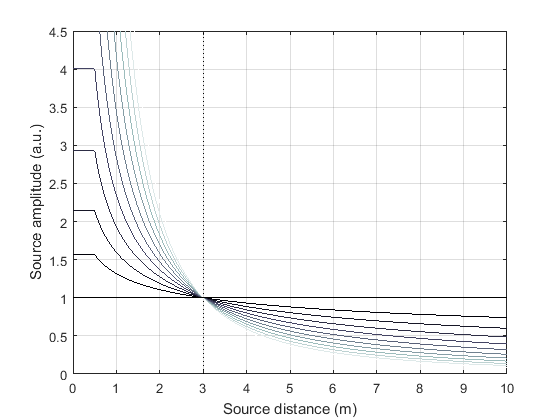
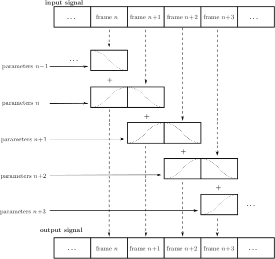
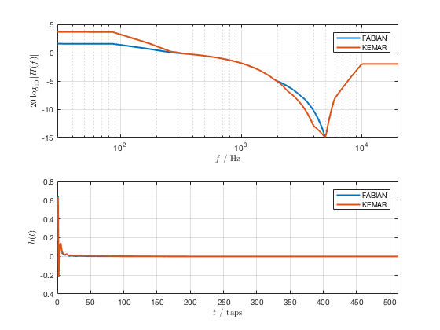

.. ****************************************************************************
 * Copyright © 2012-2014 Institut für Nachrichtentechnik, Universität Rostock *
 * Copyright © 2006-2014 Quality & Usability Lab,                             *
 *                       Telekom Innovation Laboratories, TU Berlin           *
 *                                                                            *
 * This file is part of the SoundScape Renderer (SSR).                        *
 *                                                                            *
 * The SSR is free software:  you can redistribute it and/or modify it  under *
 * the terms of the  GNU  General  Public  License  as published by the  Free *
 * Software Foundation, either version 3 of the License,  or (at your option) *
 * any later version.                                                         *
 *                                                                            *
 * The SSR is distributed in the hope that it will be useful, but WITHOUT ANY *
 * WARRANTY;  without even the implied warranty of MERCHANTABILITY or FITNESS *
 * FOR A PARTICULAR PURPOSE.                                                  *
 * See the GNU General Public License for more details.                       *
 *                                                                            *
 * You should  have received a copy  of the GNU General Public License  along *
 * with this program.  If not, see <http://www.gnu.org/licenses/>.            *
 *                                                                            *
 * The SSR is a tool  for  real-time  spatial audio reproduction  providing a *
 * variety of rendering algorithms.                                           *
 *                                                                            *
 * http://spatialaudio.net/ssr                           ssr@spatialaudio.net *
 ******************************************************************************

.. _renderers:

The Renderers
=============

General
-------

.. _reproduction_setups:

Reproduction Setups
~~~~~~~~~~~~~~~~~~~

The geometry of the actual reproduction setup is specified in ``.asd``
files, just like sound scenes. By default, it is loaded from the file
``/usr/local/share/ssr/default_setup.asd``. Use the ``--setup`` command
line option to load another reproduction setup file. Note that the
loudspeaker setups have to be convex. This is not checked by the SSR.
The loudspeakers appear at the outputs of your sound card in the same
order as they are specified in the ``.asd`` file, starting with channel
1.

A sample reproduction setup description:

::

    <?xml version="1.0"?>
    <asdf version="0.1">
      <header>
        <name>Circular Loudspeaker Array</name>
      </header>
      <reproduction_setup>
        <circular_array number="56">
          <first>
            <position x="1.5" y="0"/>
            <orientation azimuth="-180"/>
          </first>
        </circular_array>
      </reproduction_setup>
    </asdf>

We provide the following setups in the directory
``data/reproduction_setups/``:

-  ``2.0.asd``: standard stereo setup at 1.5 mtrs distance

-  ``2.1.asd``: standard stereo setup at 1.5 mtrs distance plus
   subwoofer

-  ``5.1.asd``: standard 5.1 setup on circle with a diameter of 3 mtrs

-  ``rounded_rectangle.asd``: Demonstrates how to combine circular arcs
   and linear array segments.

-  ``circle.asd``: This is a circular array of 3 mtrs diameter composed
   of 56 loudspeakers.

-  ``loudspeaker_setup_with_nearly_all_features.asd``: This setup
   describes all supported options, open it with your favorite text
   editor and have a look inside.

There is some limited freedom in assigning channels to
loudspeakers: If you insert the element ``<skip number="5"/>``, the
specified number of output channels are skipped and the following
loudspeakers get higher channel numbers accordingly.

Of course, the binaural and BRS renderers do not load a loudspeaker
setup. By default, they assume the listener to reside in the coordinate
origin looking straight forward.

A Note on the Timing of the Audio Signals
~~~~~~~~~~~~~~~~~~~~~~~~~~~~~~~~~~~~~~~~~

The WFS renderer is the only renderer in which the timing of the audio
signals is somewhat peculiar. None of the other renderers imposes any
algorithmic delay on individual source signals. Of course, if you use a
renderer that is convolution based such as the BRS renderer, the
employed HRIRs do alter the timing of the signals due to their inherent
properties.

This is different with the WFS renderer. Here, also the propagation
duration of sound from the position of the virtual source to the
loudspeaker array is taken into account. This means that the farther a virtual
source is located, the longer is the delay imposed on its input signal.
This also holds true for plane waves: Theoretically, plane waves do
originate from infinity. Though, the SSR does consider the origin point
of the plane wave that is specified in ASDF. This origin point also
specifies the location of the symbol that represents the respective
plane wave in the GUI.

We are aware that this procedure can cause confusion and reduces the
ability of a given scene of translating well between different types of
renderers. In the upcoming version 0.4 of the SSR we will implement an
option that will allow you specifying for each individual source whether
the propagation duration of sound shall be considered by a renderer or
not.

Subwoofers
~~~~~~~~~~

All loudspeaker-based renderers support the use of subwoofers. Outputs of the
SSR that are assigned to subwoofers receive a signal having full bandwidth. So,
you will have to make sure yourself that your system lowpasses these signals
appropriately before they are emitted by the subwoofers.

You might need to adjust the level of your subwoofer(s) depending on the
renderers that you are using as the overall radiated power of the normal
speakers cannot be predicted easily so that we cannot adjust for it
automatically. For example, no matter of how many loudspeakers your setup is
composed of the VBAP renderer will only use two loudspeakers at a time to
present a given virtual sound source. The WFS renderer on the other hand might
use 10 or 20 loudspeakers, which can clearly lead to a different sound pressure
level at a given receiver location.

For convenience, ASDF allows for specifying permantent weight for loudspeakers
and subwoofers using the ``weight`` attribute:

::

    <loudspeaker model="subwoofer" weight="0.5">
      <position x="0" y="0"/>
      <orientation azimuth="0"/>
    </loudspeaker>

``weight`` is a linear factor that is always applied to the signal of this
speaker. Above example will obviously attenuate the signal by approx. 6 dB. You
can use two ASDF description for the same reproduction setup that
differ only with respect to the subwoofer weights if you're using different
renderers on the same loudspeaker system.

Distance Attenuation
~~~~~~~~~~~~~~~~~~~~

Note that in all renderers -- except for the BRS and generic renderers --, the
distance attenuation in the virtual space is :math:`\frac{1}{r}` with respect
to the distance :math:`r` of the respective virtual point source to the
reference position. Point sources closer than 0.5 m to the reference position
do not experience any increase of amplitude. Virtual plane waves do not
experience any algorithmic distance attenuation in any renderer.

You can specify your own preferred distance attenuation exponent :math:`exp`
(in :math:`\frac{1}{r^{exp}}`) either via the command line argument
``--decay-exponent=VALUE`` or the configuration option ``DECAY_EXPONENT`` (see
the file ``data/ssr.conf.example``). The higher the exponent, the faster is the
amplitude decay over distance. The default exponent is
:math:`exp = 1` [1]_. Fig. :ref:`3.1 <distance_attenuation>` illustrates the effect
of different choices of the exponent. In simple words, the smaller the exponent
the slower is the amplitude decay over distance. Note that the default decay of
:math:`\frac{1}{r}` is theoretically correct only for infinitessimally small
sound sources. Spatially extended sources, like most real world sources, exhibit
a slower decay. So you might want to choose the exponent to be somewhere between
0.5 and 1. You can completely suppress any sort of distance attenuation by
setting the decay exponent to 0.

The amplitude reference distance, i.e. the distance from the reference
at which plane waves are as loud as the other source types (like point
sources), can be set in the SSR configuration file
(Section :ref:`Configuration File <ssr_configuration_file>`). The desired
amplitude reference distance for a given sound scene can be specified in
the scene description (Section :ref:`ASDF <asdf>`). The default value is 3 m.

The overall amplitude normalization is such that plane waves always exhibit the
same amplitude independent of what amplitude reference distance and what decay
exponent have been chosen. Consequently, also virtual point source always
exhibit the same amplitude at amplitude reference distance, whatever it has
been set to.

.. _distance_attenuation:

    Illustration of the amplitude of virtual point sources as a function of
    source distance from the reference point for different exponents
    :math:`exp`. The exponents range from 0 to 2 (black color to gray color).
    The amplitude reference distance is set to 3 m. Recall that sources
    closer than 0.5 m to the reference position do not experience any further
    increase of amplitude.

.. [1]
   A note regarding previous versions of the WFS renderer: In the present SSR
   version, the amplitude decay is handled centrally and equally for all
   renderers that take distance attenuation into account (see Table
   :ref:`2 <source_props>`). Previously, the WFS renderer relied on the distance
   attenuation that was inherent to the WFS driving function. This amplitude
   decay is very similar to an exponent of 0.5 (instead of the current default
   exponent of 1.0). So you  might want to set the decay exponent to 0.5 in WFS
   to make your scenes sound like they used to do previously.

Doppler Effect
~~~~~~~~~~~~~~

In the current version of the SSR the Doppler Effect in moving sources
is not supported by any of the renderers.

Signal Processing
~~~~~~~~~~~~~~~~~

All rendering algorithms are implemented on a frame-wise basis with an
internal precision of 32 bit floating point. The signal processing is
illustrated in Fig. :ref:`3.2 <signal_processing>`.

The input signal is divided into individual frames of size *nframes*,
whereby *nframes* is the frame size with which JACK is running. Then
e.g. frame number :math:`n+1` is processed both with previous rendering
parameters :math:`n` as well as with current parameters :math:`n+1`\ .
It is then crossfaded between both processed frames with cosine-shaped
slopes. In other words the effective frame size of the signal processing
is :math:`2\cdot`\ *nframes* with 50% overlap. Due to the
fade-in of the frame processed with the current parameters :math:`n+1`\ ,
the algorithmic latency is slightly higher than for processing done with
frames purely of size *nframes* and no crossfade.

.. _signal_processing:

    Illustration of the frame-wise signal processing
    as implemented in the SSR renderers (see text)

The implementation approach described above is one version of the
standard way of implementing time-varying audio processing. Note however
that this means that with *all* renderers, moving sources are not
physically correctly reproduced. The physically correct reproduction of
moving virtual sources as in [Ahrens2008a]_ and [Ahrens2008b]_ requires a
different implementation
approach which is computationally significantly more costly.

.. [Ahrens2008a] Jens Ahrens and Sascha Spors. Reproduction of moving virtual
    sound sources with special attention to the doppler effect. In 124th
    Convention of the AES, Amsterdam, The Netherlands, May 17–20, 2008.

.. [Ahrens2008b] Jens Ahrens and Sascha Spors. Reproduction of virtual sound
    sources moving at supersonic speeds in Wave Field Synthesis. In 125th
    Convention of the AES, San Francisco, CA, Oct. 2–5, 2008.

.. _binaural_renderer:

Binaural Renderer
-----------------

Executable: ``ssr-binaural``

Binaural rendering is an approach where the acoustical influence of the
human head is electronically simulated to position virtual sound sources
in space. **Be sure that you are using headphones to listen.**

The acoustical influence of the human head is coded in so-called
head-related impulse responses (HRIRs) or equivalently by head-related transfer functions.
The HRIRs are loaded from the file ``/usr/local/share/ssr/default_hrirs.wav``. If you want
to use different HRIRs then use the ``--hrirs=FILE`` command line option or the
SSR configuration file
(Section :ref:`Configuration File <ssr_configuration_file>`) to specify
your custom location. The SSR connects its outputs automatically to
outputs 1 and 2 of your sound card.

For virtual sound sources that are closer to the reference position (=
the listener position) than 0.5 m, the HRTFs are interpolated with a
Dirac impulse. This ensures a smooth transition of virtual sources from
the outside of the listener's head to the inside.

SSR uses HRIRs with an angular resolution of :math:`1^\circ`\ . Thus,
the HRIR file contains 720 impulse responses (360 for each ear) stored
as a 720-channel .wav-file. The HRIRs all have to be of equal length and
have to be arranged in the following order:

-  1st channel: left ear, virtual source position :math:`0^\circ`

-  2nd channel: right ear, virtual source position :math:`0^\circ`

-  3rd channel: left ear, virtual source position :math:`1^\circ`

-  4th channel: right ear, virtual source position :math:`1^\circ`

-  ...

-  720th channel: right ear, virtual source position :math:`359^\circ`

If your HRIRs have lower angular resolution you have to interpolate them
to the target resolution or use the same HRIR for serveral adjacent
directions in order to fulfill the format requirements. Higher
resolution is not supported. Make sure that the sampling rate of the
HRIRs matches that of JACK. So far, we know that both 16bit and 24bit
word lengths work.

The SSR automatically loads and uses all HRIR coefficients it finds in
the specified file. You can use the ``--hrir-size=VALUE`` command line
option in order to limit the number of HRIR coefficients read and used
to ``VALUE``. You don't need to worry if your specified HRIR length
``VALUE`` exceeds the one stored in the file. You will receive a warning
telling you what the score is. The SSR will render the audio in any
case.

The actual size of the HRIRs is not restricted (apart from processing
power). The SSR cuts them into partitions of size equal to the JACK
frame buffer size and zero-pads the last partition if necessary.

Note that there's some potential to optimize the performance of the SSR
by adjusting the JACK frame size and accordingly the number of
partitions when a specific number of HRIR taps are desired. The least
computational load arises when the audio frames have the same size like
the HRIRs. By choosing shorter frames and thus using partitioned
convolution the system latency is reduced but computational load is
increased.

The HRIR sets shipped with SSR
~~~~~~~~~~~~~~~~~~~~~~~~~~~~~~

SSR comes with two different HRIR sets: FABIAN and KEMAR (QU). The differ with respect to
the manikin that was used in the measurement (FABIAN vs. KEMAR). The reference for the
FABIAN measurement is [Lindau2007]_, and the reference for the KEMAR (QU) is
[Wierstorf2011]_. The low-frequency extension from [SpatialAudio]_ has been applied to the
KEMAR (QU) HRTFs.

You will find all sets in the folder ``data/impulse_responses/hrirs/``.
The suffix ``_eq`` in the file name indicates the equalized data. The unequalized data is
of course also there. See the file
``data/impulse_responses/hrirs/hrirs_fabian_documentation.pdf`` for a few more details on
the FABIAN measurement.

Starting with SSR release 0.5.0, the default HRIR set that is loaded is headphone
compensated, i.e., we equalized the HRIRs a bit in order to compensate for the alterations
that a typical pair of headphones would apply to the ear signals. Note that by design,
headphones do not have a flat transfer function. However, when performing binaural
rendering, we need the headphones to be transparent. Our equalization may not be
perfect for all headphones or earbuds as these can exhibit very different properties
between different models.

We chose a frequency sampling-based minimum-phase filter design. The transfer functions
and impulse responses of the two compensation filters are depicted in Fig. :ref:`3.3
<hrir_comp_filters>`. The impulse responses themselves can be found in the same folder
like the HRIRs (see above). The length is 513 taps so that the unequalized
HRIRs are 512 taps long, the equalized ones are 1024 taps long.

.. _hrir_comp_filters:

    Magnitude transfer functions and impulse responses of the headphone compensation /
    equalization filters

Recall that there are several ways of defining which HRIR set is loaded, for example the
``HRIR_FILE_NAME`` in the :ref:`SSR configuration files<ssr_configuration_file>` property,
or the command line option ``--hrirs=FILE``.

.. [Lindau2007] Alexander Lindau and Stefan Weinzierl. FABIAN - Schnelle
    Erfassung binauraler Raumimpulsantworten in mehreren Freiheitsgraden. In
    Fortschritte der Akustik, DAGA Stuttgart, 2007.

.. [Wierstorf2011] Hagen Wierstorf, Matthias Geier, Alexander Raake, and Sascha Spors. A
    Free Database of Head-Related Impulse Response Measurements in the Horizontal Plane
    with Multiple Distances. In 130th Convention of the Audio Engineering Society (AES),
    May 2011.

.. [SpatialAudio] https://github.com/spatialaudio/lf-corrected-kemar-hrtfs (commit 5b5ec8)

Preparing HRIR sets
~~~~~~~~~~~~~~~~~~~

You can easily prepare your own HRIR sets for use with the SSR by
adopting the MATLAB script ``data/matlab_scripts/prepare_hrirs_cipic.m``
to your needs. This script converts the HRIRs of the KEMAR manikin
included in the CIPIC database [AlgaziCIPIC]_ to the format that the SSR
expects. See the script for further information and how to obtain the raw HRIRs. Note that
the KEMAR (CIPIC) HRIRs are not identical to the KEMAR (QU) ones.

.. [AlgaziCIPIC] V. Ralph Algazi. The CIPIC HRTF database.
    https://www.ece.ucdavis.edu/cipic/spatial-sound/hrtf-data/.

.. _brs:

Binaural Room Synthesis Renderer
--------------------------------

Executable: ``ssr-brs``

The Binaural Room Synthesis (BRS) renderer is a binaural renderer (refer
to Section :ref:`Binaural Renderer <binaural_renderer>`) which uses one
dedicated
HRIR set of each individual sound source. The motivation is to have more
realistic reproduction than in simple binaural rendering. In this
context HRIRs are typically referred to as binaural room impulse
responses (BRIRs).

Note that the BRS renderer does not consider any specification of a
virtual source's position. The positions of the virtual sources
(including their distance) are exclusively coded in the BRIRs.
Consequently, the BRS renderer does not apply any distance attenuation.
It only applies the respective source's gain and the master volume. No
interpolation with a Dirac as in the binaural renderer is performed for
very close virtual sources. The only quantity which is explicitely
considered is the orientation of the receiver, i.e. the reference.
Therefore, specification of meaningful source and receiver positions is
only necessary when a correct graphical illustration is desired.

The BRIRs are stored in the a format similar to the one for the HRIRs
for the binaural renderer (refer to
Section :ref:`Binaural Renderer <binaural_renderer>`). However, there is a
fundamental difference: In order to be consequent, the different
channels do not hold the data for different positions of the virtual
sound source but they hold the information for different head
orientations. Explicitely,

-  1st channel: left ear, head orientation :math:`0^\circ`

-  2nd channel: right ear, head orientation :math:`0^\circ`

-  3rd channel: left ear, head orientation :math:`1^\circ`

-  4th channel: right ear, head orientation :math:`1^\circ`

-  ...

-  720th channel: right ear, head orientation :math:`359^\circ`

In order to assign a set of BRIRs to a given sound source an appropriate
scene description in ``.asd``-format has to be prepared (refer also to
Section :ref:`Audio Scenes <audio_scenes>`). As shown in ``brs_example.asd``
(from the example scenes), a virtual source has the optional property
``properties_file`` which holds the location of the file containing the
desired BRIR set. The location to be specified is relative to the folder
of the scene file. Note that -- as described above -- specification of the
virtual source's position does not affect the audio processing. If you
do not specify a BRIR set for each virtual source, then the renderer
will complain and refuse processing the respective source.

We have measured the BRIRs of the FABIAN
manikin in one of our mid-size meeting rooms called Sputnik with 8
different source positions. Due to the file size, we have not included
them in the release. You can obtain the data from [BRIRs]_.

.. [BRIRs] The Sputnik BRIRs can be obtained from here:
    https://github.com/ssr-scenes/tu-berlin/tree/master/sputnik.
    More BRIR repositories are compiled here: http://www.soundfieldsynthesis.org/other-resources/#impulse-responses.

.. _vbap:

Vector Base Amplitude Panning Renderer
--------------------------------------

Executable: ``ssr-vbap``

The Vector Base Amplitude Panning (VBAP) renderer uses the algorithm
described in [Pulkki1997]_. It tries to find a loudspeaker pair between which
the phantom source is located (in VBAP you speak of a phantom source rather
than a virtual one). If it does find a loudspeaker pair whose angle is
smaller than :math:`180^\circ` then it calculates the weights
:math:`g_l` and :math:`g_r` for the left and right loudspeaker as

.. math::

   g_{l,r} = \frac{\cos\phi \sin \phi_0 \pm \sin \phi \cos \phi_0}
   {2\cos \phi_0 \sin \phi_0}.

:math:`\phi_0` is half the angle between the two loudspeakers with
respect to the listening position, :math:`\phi` is the angle between the
position of the phantom source and the direction "between the
loudspeakers".

If the VBAP renderer can not find a loudspeaker pair whose angle is
smaller than :math:`180^\circ` then it uses the closest loudspeaker
provided that the latter is situated within :math:`30^\circ`\ . If not,
then it does not render the source. If you are in verbosity level 2
(i.e. start the SSR with the ``-vv`` option) you'll see a notification
about what's happening.

Note that all virtual source types (i.e. point and plane sources) are
rendered as phantom sources.

Contrary to WFS, non-uniform distributions of loudspeakers are ok here.
Ideally, the loudspeakers should be placed on a circle around the
reference position. You can optionally specify a delay for each
loudspeakers in order to compensate some amount of misplacement. In the
ASDF (refer to Section :ref:`ASDF <asdf>`), each loudspeaker has the optional
attribute ``delay`` which determines the delay in seconds to be applied
to the respective loudspeaker. Note that the specified delay will be
rounded to an integer factor of the temporal sampling period. With 44.1
kHz sampling frequency this corresponds to an accuracy of 22.676
:math:`\mu`\ s, respectively an accuracy of 7.78 mm in terms of
loudspeaker placement. Additionally, you can specify a weight for each
loudspeaker in order to compensate for irregular setups. In the ASDF
format (refer to Section :ref:`ASDF <asdf>`), each loudspeaker has the optional
attribute ``weight`` which determines the linear (!) weight to be
applied to the respective loudspeaker. An example would be

::

    <loudspeaker delay="0.005" weight="1.1">
            <position x="1.0" y="-2.0"/>
            <orientation azimuth="-30"/>
    </loudspeaker>

Delay defaults to 0 if not specified, weight defaults to 1.

Although principally suitable, we do not recommend to use our amplitude
panning algorithm for dedicated 5.1 (or comparable) mixdowns. Our VBAP
renderer only uses adjacent loudspeaker pairs for panning which does not
exploit all potentials of such a loudspeaker setup. For the mentioned
formats specialized panning processes have been developed also employing
non-adjacent loudspeaker pairs if desired.

The VBAP renderer is rather meant to be used with non-standardized
setups.

.. [Pulkki1997] Ville Pulkki. Virtual sound source positioning using Vector
    Base Amplitude Panning. In Journal of the Audio Engineering Society (JAES),
    Vol.45(6), June 1997.

.. _wfs:

Wave Field Synthesis Renderer
-----------------------------

Executable: ``ssr-wfs``

The Wave Field Synthesis (WFS) renderer is the only renderer so far
that discriminates between virtual point sources and plane waves. It
implements the simple (far-field) driving function given in [Spors2008]_. Note
that we have only
implemented a temporary solution to reduce artifacts when virtual sound
sources are moved. This topic is subject to ongoing research. We will
work on that in the future. In the SSR configuration file
(Section :ref:`Configuration File <ssr_configuration_file>`) you can
specify an overall predelay (this is necessary to render focused
sources) and the overall length of the involved delay lines. Both values
are given in samples.

.. [Spors2008] Sascha Spors, Rudolf Rabenstein, and Jens Ahrens. The theory of
    Wave Field Synthesis revisited. In 124th Convention of the AES, Amsterdam,
    The Netherlands, May 17–20, 2008.

Prefiltering
~~~~~~~~~~~~

As you might know, WFS requires a spectral correction additionally to
the delay and weighting of the input signal. Since this spectral
correction is equal for all loudspeakers, it needs to be performed only
once on the input. We are working on an automatic generation of the
required filter. Until then, we load the impulse response of the desired
filter from a .wav-file which is specified via the ``--prefilter=FILE``
command line option (see Section :ref:`Running SSR <running_ssr>`) or in the
SSR configuration file
(Section :ref:`Configuration File <ssr_configuration_file>`). Make sure
that the specified audio file contains only one channel. Files with a
differing number of channels will not be loaded. Of course, the sampling
rate of the file also has to match that of the JACK server.

Note that the filter will be zero-padded to the next highest power of 2.
If the resulting filter is then shorter than the current JACK frame
size, each incoming audio frame will be divided into subframes for
prefiltering. That means, if you load a filter of 100 taps and JACK
frame size is 1024, the filter will be padded to 128 taps and
prefiltering will be done in 8 cycles. This is done in order to save
processing power since typical prefilters are much shorter than typical
JACK frame sizes. Zero-padding the prefilter to the JACK frame size
usually produces large overhead. If the prefilter is longer than the
JACK frame buffer size, the filter will be divided into partitions whose
length is equal to the JACK frame buffer size.

If you do not specify a filter, then no prefiltering is performed. This
results in a boost of bass frequencies in the reproduced sound field.

In order to assist you in the design of an appropriate prefilter, we
have included the MATLAB script
``data/matlab_scripts/make_wfs_prefilter.m`` which does the job. In the
very top of the file, you can specify the sampling frequency, the
desired length of the filter as well as the lower and upper frequency
limits of the spectral correction. The lower limit should be chosen such
that the subwoofer of your system receives a signal which is not
spectrally altered. This is due to the fact that only loudspeakers which
are part of an array of loudspeakers need to be corrected. The lower
limit is typically around 100 Hz. The upper limit is given by the
spatial aliasing frequency. The spatial aliasing is dependent on the
mutual distance of the loudspeakers, the distance of the considered
listening position to the loudspeakers, and the array geometry. See [Spors2006]_ for
detailed information on how to determine the spatial aliasing frequency
of a given loudspeaker setup. The spatial aliasing frequency is
typically between 1000 Hz and 2000 Hz. For a theoretical treatment of
WFS in general and also the prefiltering, see [Spors2008]_.

The script ``make_wfs_prefilter.m`` will save the impulse response of
the designed filter in a file like ``wfs_prefilter_120_1500_44100.wav``.
From the file name you can extract that the spectral correction starts
at 120 Hz and goes up to 1500 Hz at a sampling frequency of 44100 Hz.
Check the folder ``data/impules_responses/wfs_prefilters`` for a small
selection of prefilters.

.. [Spors2006] Sascha Spors and Rudolf Rabenstein. Spatial aliasing artifacts
    produced by linear and circular loudspeaker arrays used for Wave
    Field Synthesis. In 120th Convention of the AES, Paris, France,
    May 20–23, 2006.

Tapering
~~~~~~~~

When the listening area is not enclosed by the loudspeaker setup,
artifacts arise in the reproduced sound field due to the limited
aperture. This problem of spatial truncation can be reduced by so-called
tapering. Tapering is essentially an attenuation of the loudspeakers
towards the ends of the setup. As a consequence, the boundaries of the
aperture become smoother which reduces the artifacts. Of course, no
benefit comes without a cost. In this case the cost is amplitude errors
for which the human ear fortunately does not seem to be too sensitive.

In order to taper, you can assign the optional attribute ``weight`` to
each loudspeaker in ASDF format (refer to Section [sec:asdf]). The
``weight`` determines the linear (!) weight to be applied to the
respective loudspeaker. It defaults to 1 if it is not specified.

.. _aap:

Ambisonics Amplitude Panning Renderer
-------------------------------------

Executable: ``ssr-aap``

The Ambisonics Amplitude Panning (AAP) renderer does very simple
Ambisonics rendering. It does amplitude panning by simultaneously using
all loudspeakers that are not subwoofers to reproduce a virtual source
(contrary to the VBAP renderer which uses only two loudspeakers at a
time). Note that the loudspeakers should ideally be arranged on a circle
and the reference should be the center of the circle. The renderer
checks for that and applies delays and amplitude corrections to all
loudspeakers that are closer to the reference than the farthest. This
also includes subwoofers. If you do not want close loudspeakers to be
delayed, then simply specify their location in the same direction like
its actual position but at a larger distance from the reference. Then
the graphical illustration will not be perfectly aligned with the real
setup, but the audio processing will take place as intended. Note that
the AAP renderer ignores delays assigned to an individual loudspeaker in
ASDF. On the other hand, it does consider weights assigned to the
loudspeakers. This allows you to compensate for irregular loudspeaker
placement.

Note finally that AAP does not allow to encode the distance of a virtual
sound source since it is a simple panning renderer. All sources will
appear at the distance of the loudspeakers.

If you do not explicitly specify an Ambisonics order, then the maximum
order which makes sense on the given loudspeaker setup will be used. The
automatically chosen order will be one of :math:`(L-1)/2` for an odd number
:math:`L` of loudspeakers and accordingly for even numbers.

You can manually set the order via a command line option
(Section :ref:`Running SSR <running_ssr>`) or the SSR configuration file
(Section :ref:`Configuration File <ssr_configuration_file>`). We therefore
do not explicitly discriminate between "higher order" and "lower order"
Ambisonics since this is not a fundamental property. And where does
"lower order" end and "higher order" start anyway?

Note that the graphical user interface will not indicate the activity of
the loudspeakers since theoretically all loudspeakers contribute to the
sound field of a virtual source at any time.

Conventional driving function
~~~~~~~~~~~~~~~~~~~~~~~~~~~~~

By default we use the standard Ambisonics panning function presented,
for example, in [Neukom2007]_. It reads

.. math::

   d(\alpha_0)  = \frac{\sin\left ( \frac{2M+1}{2} \ (\alpha_0 -
   \alpha_\textrm{s})\right )} {(2M+1) \ \sin \left ( \frac{\alpha_0 -
   \alpha_\textrm{s}}{2} \right ) },

whereby :math:`\alpha_0` is the azimuth angle of the position of the
considered secondary source, :math:`\alpha_\textrm{s}` is the azimuth
angle of the position of the virtual source, both in radians, and :math:`M` is
the Ambisonics order.

In-phase driving function
~~~~~~~~~~~~~~~~~~~~~~~~~

The conventional driving function leads to both positive and negative
weights for individual loudspeakers. An object (e.g. a listener)
introduced into the listening area can lead to an imperfect interference
of the wave fields of the individual loudspeakers and therefore to an
inconsistent perception. Furthermore, conventional Ambisonics panning
can lead to audible artifacts for fast source motions since it can
happen that the weights of two adjacent audio frames have a different
algebraic sign.

These problems can be worked around when only positive weights are
applied on the input signal (*in-phase* rendering). This can be
accomplished via the in-phase driving function given e.g. in [Neukom2007]_
reading

.. math:: d(\alpha_0) = \cos^{2M} \left (\frac{\alpha_0 - \alpha_\textrm{s}}{2}
 \right ) \ . \nonumber

Note that in-phase rendering leads to a less precise localization of the
virtual source and other unwanted perceptions. You can enable in-phase
rendering via the according command-line option or you can set the
``IN_PHASE_RENDERING`` property in the SSR configuration file (see
section :ref:`Configuration File <ssr_configuration_file>`) to be
``TRUE`` or ``true``.

.. [Neukom2007] Martin Neukom. Ambisonic panning. In 123th Convention of the
    AES, New York, NY, USA, Oct. 5–8, 2007.

.. _dca:

Distance-coded Ambisonics Renderer
----------------------------------

Executable: ``ssr-dca``

Distance-coded Ambisonics (DCA) is sometimes also termed "Nearfield Compensated Higher-Order Ambisonics". This renderer implements the driving functions from [Spors2011]_. The difference to the AAP renderer is a long story, which we will elaborate on at a later point.

Note that the DCA renderer is experimental at this stage. It currently supports orders of up to 28. There are some complications regarding how the user specifies the locations of the loudspeakers and how the renderer handles them. The rendered scene might appear mirrored or rotated. If you are experiencing this, you might want to play around with the assignment of the outputs and the loudspeakers to fix it temporarily. Or contact us.

Please bear with us. We are going to take care of this soon.

.. [Spors2011] S. Spors, V. Kuscher, and J. Ahrens. Efficient Realization of Model-Based Rendering for 2.5-dimensional Near-Field Compensated Higher Order Ambisonics. In IEEE WASPAA, New Paltz, NY, USA, 2011.

.. _genren:

Generic Renderer
----------------

Executable: ``ssr-generic``

The generic renderer turns the SSR into a multiple-input-multiple-output
convolution engine. You have to use an ASDF file in which the attribute
``properties_file`` of the individual sound source has to be set
properly. That means that the indicated file has to be a multichannel
file with the same number of channels like loudspeakers in the setup.
The impulse response in the file at channel 1 represents the driving
function for loudspeaker 1 and so on.

Be sure that you load a reproduction setup with the corresponding number
of loudspeakers.

It is obviously not possible to move virtual sound sources since the
loaded impulse responses are static. We use this renderer in order to
test advanced methods before implementing them in real-time or to
compare two different rendering methods by having one sound source in
one method and another sound source in the other method.

Download the ASDF examples from https://github.com/SoundScapeRenderer/example-scenes and check out the file ``generic_renderer_example.asd`` which comes with all required data.

Look also :ref:`here <mimo>` for more general signal processing examples using SSR.

.. _loudspeaker_properties:

==================   ================   ======
      ..             individual delay   weight
------------------   ----------------   ------
 binaural renderer      *-*              *-*
 BRS renderer           *-*              *-*
 VBAP renderer          *+*              *+*
 WFS renderer           *-*              *+*
 AAP renderer          autom.            *+*
 generic renderer       *-*              *-*
==================   ================   ======

Table 1: Loudspeaker properties considered by the different renderers.

.. _source_props:

=================   ======   =====  ========  ================  ====================  =================
       ..           gain     mute   position  orientation [2]_  distance attenuation  model
-----------------   ------   -----  --------  ----------------  --------------------  -----------------
binaural renderer    *+*     *+*     *+*         *+*                   *+*            only w.r.t. ampl.
BRS renderer         *+*     *+*     *-*         *-*                   *-*              *-*
VBAP renderer        *+*     *+*     *+*         *+*                   *+*            only w.r.t. ampl.
WFS renderer         *+*     *+*     *+*         *+*                   *+*              *+*
AAP renderer         *+*     *+*     *+*         *-*                   *+*            only w.r.t. ampl.
generic renderer     *+*     *+*     *-*         *-*                   *-*              *-*
=================   ======   =====  ========  ================  ====================  =================

Table 2: Virtual source's properties considered by the different renderers.

Summary
-------

Tables :ref:`1 <loudspeaker_properties>` and :ref:`2 <source_props>` summarize
the functionality of the
SSR renderers.

.. [2]
   So far, only planar sources have a defined orientation. By default, their
   orientation is always pointing from their nominal position to the reference
   point no matter where you move them. Any other information or updates on the
   orientation are ignored. You can changes this behavior by using either the
   command line option ``--no-auto-rotation``, using the ``AUTO_ROTATION``
   configuration parameter, or hitting ``r`` in the GUI.
